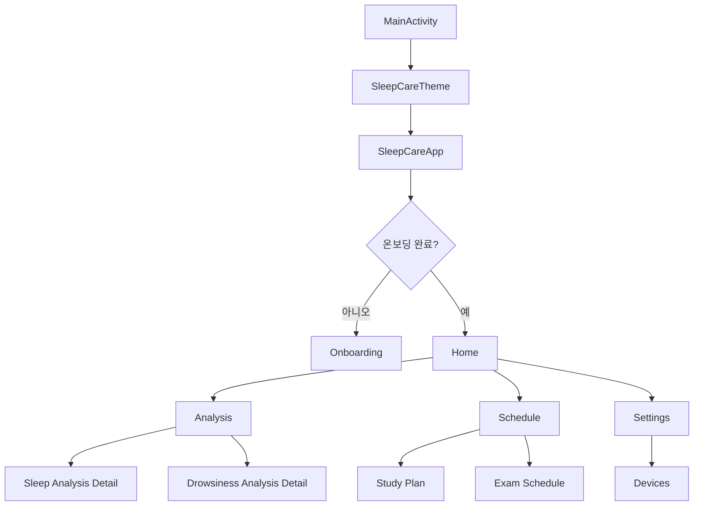
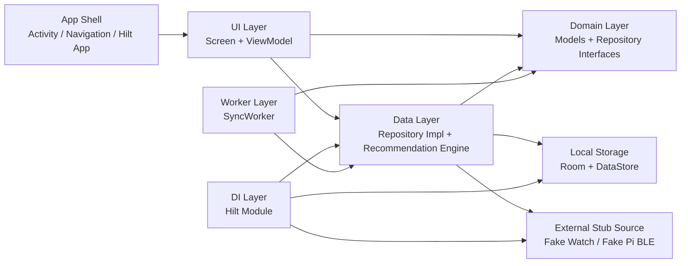
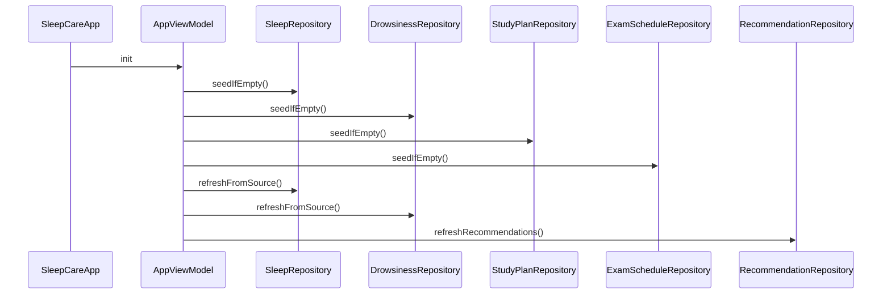
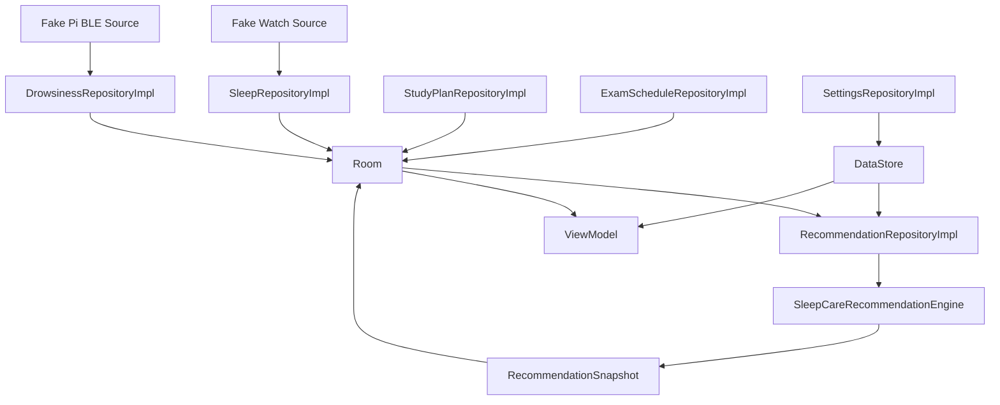
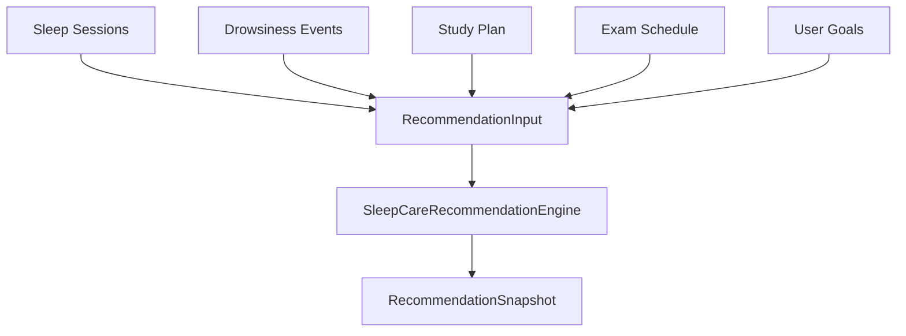
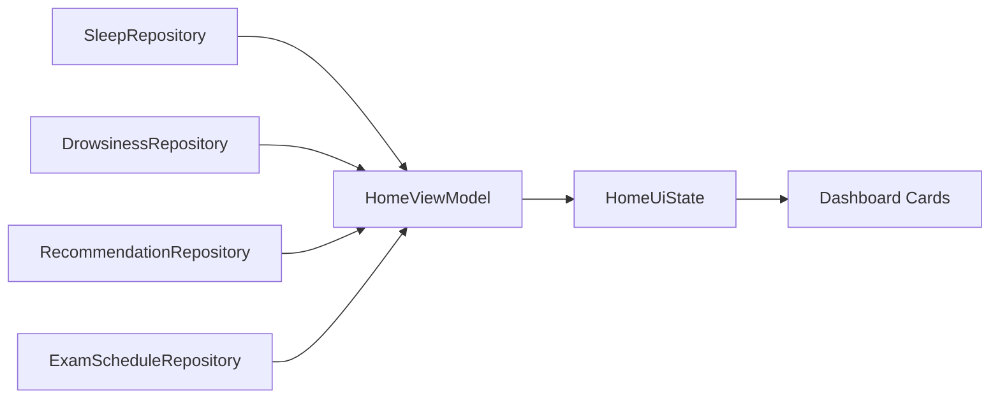
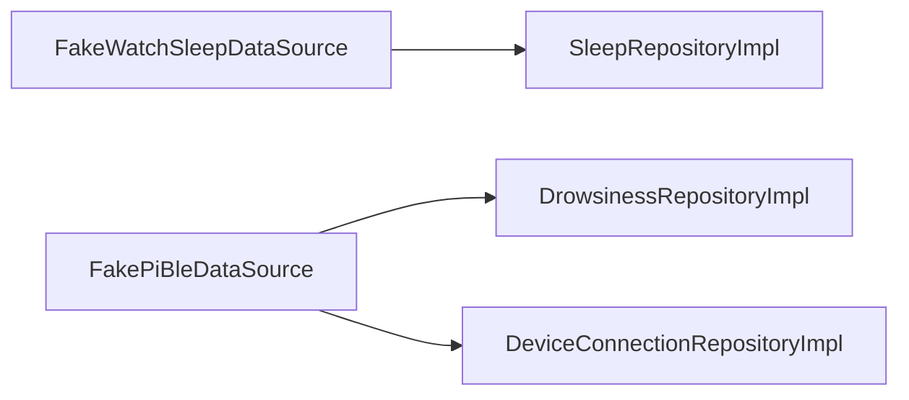

# Sleep Care Mobile 현재 구현 정리

이 문서는 현재 저장소에 구현된 Android 앱의 구조와 동작을 한 번에 파악할 수 있도록 정리한 가이드입니다.

- 기준 저장소: `/mnt/c/Users/cksgm/.gemini/antigravity/scratch/sleep_care-mobile`
- 앱 성격: Android 네이티브 `Kotlin + Jetpack Compose` 앱
- 목표: 수면 데이터와 공부 중 졸음 이벤트를 함께 분석해 수면 루틴과 공부 타이밍을 제안하는 MVP

## 1. 한눈에 보는 구현 상태

- 단일 Activity 기반 Compose 앱 구조가 구현되어 있습니다.
- 온보딩, 홈, 분석, 수면 스케줄, 학습 플랜, 시험 일정, 설정, 기기 연결 화면이 모두 존재합니다.
- 데이터 저장은 `Room + DataStore`를 사용합니다.
- 외부 연동은 실제 구현이 아니라 `Fake Watch / Fake Pi BLE` 스텁으로 연결되어 있습니다.
- 추천 로직은 규칙 기반 엔진으로 구현되어 있습니다.
- WorkManager 의존성과 Worker는 존재하지만, 주기 작업 스케줄 등록은 아직 본격적으로 연결되지 않았습니다.
- 기본 단위 테스트가 포함되어 있습니다.

## 2. 앱 전체 구조



### 핵심 진입점

- 앱 Activity 진입: [MainActivity.kt](/mnt/c/Users/cksgm/.gemini/antigravity/scratch/sleep_care-mobile/app/src/main/java/com/sleepcare/mobile/MainActivity.kt)
- 앱 레벨 Hilt 설정: [SleepCareApplication.kt](/mnt/c/Users/cksgm/.gemini/antigravity/scratch/sleep_care-mobile/app/src/main/java/com/sleepcare/mobile/SleepCareApplication.kt)
- 앱 셸, 라우팅, 앱 초기 시드/리셋 처리: [SleepCareApp.kt](/mnt/c/Users/cksgm/.gemini/antigravity/scratch/sleep_care-mobile/app/src/main/java/com/sleepcare/mobile/navigation/SleepCareApp.kt)

## 3. 레이어별 의존 관계



### 레이어별 실제 파일

#### App Shell

- [MainActivity.kt](/mnt/c/Users/cksgm/.gemini/antigravity/scratch/sleep_care-mobile/app/src/main/java/com/sleepcare/mobile/MainActivity.kt)
- [SleepCareApplication.kt](/mnt/c/Users/cksgm/.gemini/antigravity/scratch/sleep_care-mobile/app/src/main/java/com/sleepcare/mobile/SleepCareApplication.kt)
- [SleepCareApp.kt](/mnt/c/Users/cksgm/.gemini/antigravity/scratch/sleep_care-mobile/app/src/main/java/com/sleepcare/mobile/navigation/SleepCareApp.kt)

#### UI Layer

- [OnboardingScreen.kt](/mnt/c/Users/cksgm/.gemini/antigravity/scratch/sleep_care-mobile/app/src/main/java/com/sleepcare/mobile/ui/onboarding/OnboardingScreen.kt)
- [HomeScreen.kt](/mnt/c/Users/cksgm/.gemini/antigravity/scratch/sleep_care-mobile/app/src/main/java/com/sleepcare/mobile/ui/home/HomeScreen.kt)
- [AnalysisScreens.kt](/mnt/c/Users/cksgm/.gemini/antigravity/scratch/sleep_care-mobile/app/src/main/java/com/sleepcare/mobile/ui/analysis/AnalysisScreens.kt)
- [ScheduleScreens.kt](/mnt/c/Users/cksgm/.gemini/antigravity/scratch/sleep_care-mobile/app/src/main/java/com/sleepcare/mobile/ui/schedule/ScheduleScreens.kt)
- [SettingsScreen.kt](/mnt/c/Users/cksgm/.gemini/antigravity/scratch/sleep_care-mobile/app/src/main/java/com/sleepcare/mobile/ui/settings/SettingsScreen.kt)
- [DeviceConnectionScreen.kt](/mnt/c/Users/cksgm/.gemini/antigravity/scratch/sleep_care-mobile/app/src/main/java/com/sleepcare/mobile/ui/devices/DeviceConnectionScreen.kt)
- 공통 UI: [SleepCareComponents.kt](/mnt/c/Users/cksgm/.gemini/antigravity/scratch/sleep_care-mobile/app/src/main/java/com/sleepcare/mobile/ui/components/SleepCareComponents.kt)
- 포맷터: [UiFormatters.kt](/mnt/c/Users/cksgm/.gemini/antigravity/scratch/sleep_care-mobile/app/src/main/java/com/sleepcare/mobile/ui/components/UiFormatters.kt)
- 테마: [Theme.kt](/mnt/c/Users/cksgm/.gemini/antigravity/scratch/sleep_care-mobile/app/src/main/java/com/sleepcare/mobile/ui/theme/Theme.kt), [Color.kt](/mnt/c/Users/cksgm/.gemini/antigravity/scratch/sleep_care-mobile/app/src/main/java/com/sleepcare/mobile/ui/theme/Color.kt), [Type.kt](/mnt/c/Users/cksgm/.gemini/antigravity/scratch/sleep_care-mobile/app/src/main/java/com/sleepcare/mobile/ui/theme/Type.kt)

#### Domain Layer

- [Models.kt](/mnt/c/Users/cksgm/.gemini/antigravity/scratch/sleep_care-mobile/app/src/main/java/com/sleepcare/mobile/domain/Models.kt)
- [Repositories.kt](/mnt/c/Users/cksgm/.gemini/antigravity/scratch/sleep_care-mobile/app/src/main/java/com/sleepcare/mobile/domain/Repositories.kt)

#### Data Layer

- 저장소 구현과 추천 엔진: [AppRepositories.kt](/mnt/c/Users/cksgm/.gemini/antigravity/scratch/sleep_care-mobile/app/src/main/java/com/sleepcare/mobile/data/repository/AppRepositories.kt)
- 로컬 저장: [LocalStorage.kt](/mnt/c/Users/cksgm/.gemini/antigravity/scratch/sleep_care-mobile/app/src/main/java/com/sleepcare/mobile/data/local/LocalStorage.kt)
- 외부 연동 스텁: [FakeSources.kt](/mnt/c/Users/cksgm/.gemini/antigravity/scratch/sleep_care-mobile/app/src/main/java/com/sleepcare/mobile/data/source/FakeSources.kt)

#### DI / Worker

- Hilt 모듈: [AppModule.kt](/mnt/c/Users/cksgm/.gemini/antigravity/scratch/sleep_care-mobile/app/src/main/java/com/sleepcare/mobile/di/AppModule.kt)
- 백그라운드 동기화 Worker: [SyncWorker.kt](/mnt/c/Users/cksgm/.gemini/antigravity/scratch/sleep_care-mobile/app/src/main/java/com/sleepcare/mobile/worker/SyncWorker.kt)

## 4. 앱 시작 시 초기화 흐름

`SleepCareApp` 내부의 `AppViewModel`이 앱 시작 시 초기 데이터와 추천 계산을 한 번에 처리합니다.



### 이 흐름에서 하는 일

- 수면 데이터가 비어 있으면 샘플 수면 데이터를 채웁니다.
- 졸음 데이터가 비어 있으면 샘플 졸음 이벤트를 채웁니다.
- 학습 플랜과 시험 일정의 기본값을 채웁니다.
- 외부 source에서 최신 데이터를 다시 읽어 저장합니다.
- 마지막으로 추천 스냅샷을 계산해 저장합니다.

## 5. 데이터 흐름



### 저장 방식

#### Room에 저장되는 데이터

- 수면 세션
- 졸음 이벤트
- 학습 플랜
- 시험 일정
- 추천 스냅샷

위치는 [LocalStorage.kt](/mnt/c/Users/cksgm/.gemini/antigravity/scratch/sleep_care-mobile/app/src/main/java/com/sleepcare/mobile/data/local/LocalStorage.kt) 입니다.

#### DataStore에 저장되는 데이터

- 온보딩 완료 여부
- 졸음 알림 설정
- 수면 리마인더 설정
- 사용자 목표 기상/취침 시각
- 마지막 동기화 시각

역시 [LocalStorage.kt](/mnt/c/Users/cksgm/.gemini/antigravity/scratch/sleep_care-mobile/app/src/main/java/com/sleepcare/mobile/data/local/LocalStorage.kt)의 `PreferencesStore`에 있습니다.

## 6. 추천 엔진 구조

추천 엔진은 여러 소스의 데이터를 모아 규칙 기반으로 취침/기상 시각을 계산합니다.



### 입력 요소

- 최근 수면 세션
- 최근 졸음 이벤트
- 학습 플랜
- 시험 일정
- 사용자 목표

### 주요 계산 규칙

#### 기상 시각 결정 우선순위

1. 가까운 시험이 있으면 시험 시작 90분 전
2. 없으면 사용자 목표 기상 시각
3. 없으면 학습 시작 시각 90분 전
4. 그래도 없으면 `06:30`

#### 목표 수면 시간

- 평균 수면 시간이 짧거나 졸음 이벤트가 많으면 더 긴 수면 시간 권장
- 기본적으로 `450분` 또는 `480분`을 사용

#### 추천 결과

- 권장 취침 시각
- 권장 기상 시각
- 목표 수면 시간
- 추천 이유
- 현재 루틴에서 얼마나 당기거나 늦춰야 하는지
- 행동 팁 3개

## 7. 주요 화면별 역할

### 7.1 온보딩

- 파일: [OnboardingScreen.kt](/mnt/c/Users/cksgm/.gemini/antigravity/scratch/sleep_care-mobile/app/src/main/java/com/sleepcare/mobile/ui/onboarding/OnboardingScreen.kt)
- 역할:
  - 앱 소개
  - 핵심 기능 소개
  - 시작 버튼 탭 시 온보딩 완료 상태 저장

### 7.2 홈 대시보드

- 파일: [HomeScreen.kt](/mnt/c/Users/cksgm/.gemini/antigravity/scratch/sleep_care-mobile/app/src/main/java/com/sleepcare/mobile/ui/home/HomeScreen.kt)
- 역할:
  - 어제 수면 점수 및 총 수면 시간 요약
  - 최근 졸음 빈도 표시
  - 오늘 추천 취침/기상 시각 표시
  - 추천 이유 노출
  - 다음 시험 일정 표시
  - 공부 피로 타임라인 시각화



### 7.3 분석 허브

- 파일: [AnalysisScreens.kt](/mnt/c/Users/cksgm/.gemini/antigravity/scratch/sleep_care-mobile/app/src/main/java/com/sleepcare/mobile/ui/analysis/AnalysisScreens.kt)
- 역할:
  - 수면 품질 요약
  - 졸음 이벤트 요약
  - 세부 분석 화면으로 이동

### 7.4 수면 분석 상세

- 최근 일주일 평균 수면 시간
- 규칙성 점수
- 수면 지연 시간
- 주간 수면 길이 타임라인
- 수면 루틴 제안

### 7.5 졸음 분석 상세

- 총 졸음 이벤트 수
- 피크 시간대
- 포커스 점수
- 최근 이벤트 목록

### 7.6 수면 스케줄 제안

- 파일: [ScheduleScreens.kt](/mnt/c/Users/cksgm/.gemini/antigravity/scratch/sleep_care-mobile/app/src/main/java/com/sleepcare/mobile/ui/schedule/ScheduleScreens.kt)
- 역할:
  - 추천 취침/기상 시각 표시
  - 목표 수면 시간 표시
  - 추천 이유와 팁 표시
  - 학습 플랜 수정 진입
  - 시험 일정 관리 진입

### 7.7 학습 플랜

- 시작 시간
- 종료 시간
- 하루 목표 공부 시간
- 권장 휴식 길이
- 공부 요일
- 자동 휴식 제안 토글

저장 시에는 다음이 함께 수행됩니다.

- `StudyPlan` 저장
- 사용자 목표 기상 시각 갱신
- 추천 재계산

### 7.8 시험 일정 관리

- 시험 목록 조회
- 시험 추가 다이얼로그
- 시험 삭제
- 시험 변경 시 추천 재계산

### 7.9 설정

- 파일: [SettingsScreen.kt](/mnt/c/Users/cksgm/.gemini/antigravity/scratch/sleep_care-mobile/app/src/main/java/com/sleepcare/mobile/ui/settings/SettingsScreen.kt)
- 역할:
  - 졸음 알림 설정
  - 수면 리마인더 설정
  - 기기 연결 화면 진입
  - 마지막 동기화 정보 표시
  - 앱 데이터 초기화

### 7.10 기기 연결

- 파일: [DeviceConnectionScreen.kt](/mnt/c/Users/cksgm/.gemini/antigravity/scratch/sleep_care-mobile/app/src/main/java/com/sleepcare/mobile/ui/devices/DeviceConnectionScreen.kt)
- 역할:
  - Raspberry Pi 상태 확인
  - Smartwatch / Health Connect 상태 확인
  - 연결 재시도
  - 연결 해제
  - 기기 스캔 시작

## 8. 공통 UI 컴포넌트

공통 시각 스타일은 [SleepCareComponents.kt](/mnt/c/Users/cksgm/.gemini/antigravity/scratch/sleep_care-mobile/app/src/main/java/com/sleepcare/mobile/ui/components/SleepCareComponents.kt)에 모여 있습니다.

주요 컴포넌트는 다음과 같습니다.

- `GlassCard`
  - 반투명 카드 스타일의 기본 컨테이너
- `MetricHeroCard`
  - 큰 수치형 요약 카드
- `InsightCallout`
  - 인사이트 또는 안내 메시지 카드
- `TimelineBar`
  - 시간대/구간형 시각화
- `ScheduleHero`
  - 추천 취침/기상 시각을 크게 보여주는 카드
- `DeviceStatusCard`
  - 기기 연결 상태 카드
- `AppBottomBar`
  - 앱 하단 탭 바

## 9. 파일 구조

아래는 현재 구현 기준으로 핵심 파일만 정리한 구조입니다.

```text
sleep_care-mobile/
├── app/
│   ├── build.gradle.kts
│   └── src/
│       ├── main/
│       │   ├── AndroidManifest.xml
│       │   ├── java/com/sleepcare/mobile/
│       │   │   ├── MainActivity.kt
│       │   │   ├── SleepCareApplication.kt
│       │   │   ├── navigation/
│       │   │   │   └── SleepCareApp.kt
│       │   │   ├── di/
│       │   │   │   └── AppModule.kt
│       │   │   ├── domain/
│       │   │   │   ├── Models.kt
│       │   │   │   └── Repositories.kt
│       │   │   ├── data/
│       │   │   │   ├── local/
│       │   │   │   │   └── LocalStorage.kt
│       │   │   │   ├── repository/
│       │   │   │   │   └── AppRepositories.kt
│       │   │   │   └── source/
│       │   │   │       └── FakeSources.kt
│       │   │   ├── ui/
│       │   │   │   ├── onboarding/
│       │   │   │   │   └── OnboardingScreen.kt
│       │   │   │   ├── home/
│       │   │   │   │   └── HomeScreen.kt
│       │   │   │   ├── analysis/
│       │   │   │   │   └── AnalysisScreens.kt
│       │   │   │   ├── schedule/
│       │   │   │   │   └── ScheduleScreens.kt
│       │   │   │   ├── settings/
│       │   │   │   │   └── SettingsScreen.kt
│       │   │   │   ├── devices/
│       │   │   │   │   └── DeviceConnectionScreen.kt
│       │   │   │   ├── components/
│       │   │   │   │   ├── SleepCareComponents.kt
│       │   │   │   │   └── UiFormatters.kt
│       │   │   │   └── theme/
│       │   │   │       ├── Color.kt
│       │   │   │       ├── Theme.kt
│       │   │   │       └── Type.kt
│       │   │   └── worker/
│       │   │       └── SyncWorker.kt
│       │   └── res/
│       └── test/
│           └── java/com/sleepcare/mobile/domain/
│               ├── RecommendationEngineTest.kt
│               └── ScoreCalculatorTest.kt
├── docs/
├── stitch_exports/
├── build.gradle.kts
├── settings.gradle.kts
└── README.md
```

## 10. 외부 연동 상태

현재 앱은 실제 연동 대신 스텁 구조를 사용합니다.



### 현재 구현 상태

- 워치 수면 데이터: 샘플 데이터 반환
- Raspberry Pi BLE 상태: 스캔, 연결, 재시도, 연결 해제 흐름만 스텁으로 제공
- 졸음 이벤트: 샘플 이벤트 반환

### 의미

- UI와 상태 흐름을 먼저 검증하기 위한 구조입니다.
- 실제 Health Connect, 실제 BLE 연동으로 나중에 교체 가능한 형태입니다.

## 11. 백그라운드 작업

- 파일: [SyncWorker.kt](/mnt/c/Users/cksgm/.gemini/antigravity/scratch/sleep_care-mobile/app/src/main/java/com/sleepcare/mobile/worker/SyncWorker.kt)
- 역할:
  - 수면 데이터 refresh
  - 추천 재계산

현재는 Worker 클래스만 준비되어 있고, 주기 실행 스케줄링은 코드상에서 강하게 드러나지 않습니다.

## 12. 테스트

테스트는 도메인 계산 위주로 구성되어 있습니다.

- 추천 엔진 테스트: [RecommendationEngineTest.kt](/mnt/c/Users/cksgm/.gemini/antigravity/scratch/sleep_care-mobile/app/src/test/java/com/sleepcare/mobile/domain/RecommendationEngineTest.kt)
- 점수 계산 테스트: [ScoreCalculatorTest.kt](/mnt/c/Users/cksgm/.gemini/antigravity/scratch/sleep_care-mobile/app/src/test/java/com/sleepcare/mobile/domain/ScoreCalculatorTest.kt)

### 현재 테스트 성격

- 추천 기상 시각이 시험 일정에 맞춰 앞당겨지는지 확인
- 수면 품질 점수가 정상 범위에 들어오는지 확인
- 평균 수면 시간이 좋아질수록 포커스 점수가 개선되는지 확인

## 13. Android 설정과 권한

- Android 설정: [app/build.gradle.kts](/mnt/c/Users/cksgm/.gemini/antigravity/scratch/sleep_care-mobile/app/build.gradle.kts)
- 매니페스트: [AndroidManifest.xml](/mnt/c/Users/cksgm/.gemini/antigravity/scratch/sleep_care-mobile/app/src/main/AndroidManifest.xml)

### 주요 스택

- Kotlin
- Jetpack Compose
- Material 3
- Navigation Compose
- Hilt
- Room
- DataStore
- WorkManager

### 현재 선언된 주요 권한

- `BLUETOOTH`
- `BLUETOOTH_ADMIN`
- `BLUETOOTH_CONNECT`
- `BLUETOOTH_SCAN`
- `POST_NOTIFICATIONS`
- `FOREGROUND_SERVICE`

현재 매니페스트에는 권한이 선언돼 있지만, 런타임 권한 요청 UX는 아직 본격적으로 구현되지 않은 상태로 보입니다.

## 14. 문서와 디자인 산출물

### 문서

- [docs/plan.md](/mnt/c/Users/cksgm/.gemini/antigravity/scratch/sleep_care-mobile/docs/plan.md)
- [docs/plan-overview.md](/mnt/c/Users/cksgm/.gemini/antigravity/scratch/sleep_care-mobile/docs/plan-overview.md)
- [docs/plan-mobile-app.md](/mnt/c/Users/cksgm/.gemini/antigravity/scratch/sleep_care-mobile/docs/plan-mobile-app.md)
- [docs/plan-data-and-recommendation.md](/mnt/c/Users/cksgm/.gemini/antigravity/scratch/sleep_care-mobile/docs/plan-data-and-recommendation.md)
- [docs/plan-raspberry-pi.md](/mnt/c/Users/cksgm/.gemini/antigravity/scratch/sleep_care-mobile/docs/plan-raspberry-pi.md)
- [docs/plan-watch-app.md](/mnt/c/Users/cksgm/.gemini/antigravity/scratch/sleep_care-mobile/docs/plan-watch-app.md)
- [docs/sleepcare_protocol_design.md](/mnt/c/Users/cksgm/.gemini/antigravity/scratch/sleep_care-mobile/docs/sleepcare_protocol_design.md)

### Stitch 산출물

- [stitch_exports/onboarding](/mnt/c/Users/cksgm/.gemini/antigravity/scratch/sleep_care-mobile/stitch_exports/onboarding)
- 디자인 시스템: [theme.json](/mnt/c/Users/cksgm/.gemini/antigravity/scratch/sleep_care-mobile/stitch_exports/onboarding/design-system/theme.json)
- HTML / PNG 화면 시안:
  - 온보딩
  - 홈
  - 분석 허브
  - 수면 분석 상세
  - 졸음 분석 상세
  - 기기 연결
  - 수면 스케줄 제안
  - 학습 플랜
  - 시험 일정
  - 설정

## 15. 요약

현재 구현은 다음 특징을 갖습니다.

- Android 네이티브 Compose 앱 MVP가 실제로 돌아가는 상태입니다.
- 화면 플로우, 로컬 저장, 스텁 데이터 연동, 추천 엔진, 기본 테스트까지 포함되어 있습니다.
- 추천 기능은 수면, 졸음, 학습 플랜, 시험 일정을 모두 합친 규칙 기반 계산입니다.
- 이후 실제 기기 연동과 백그라운드 스케줄링을 붙이기 좋은 형태로 기본 뼈대가 준비되어 있습니다.

